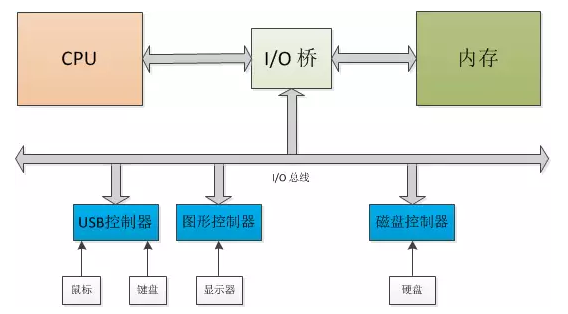
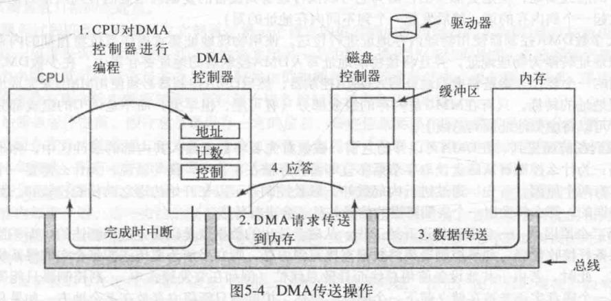
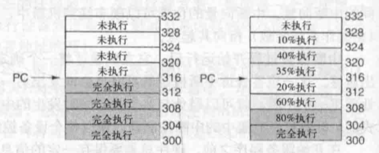

## 硬件I/O
为了方便CPU与每个I/O设备之间进行联系，设计了**总线**这样的概念，将每个I/O设备和CPU都接在这个总线上，每当有I/O设备需要的时候，就会发送一个信号给CPU，让其读取信号并执行。

不过由于设备过多，所以要给每个设备都记录一个编号，方便识别。这个编号称为**I/O端口**。

### 内存映射I/0
将I/O设备映射到内存当中，那么这个设备就只是一个内存中的变量，编写的时候可以用C语言来，不映射的话只能用汇编语言来写代码。

对于内存映射I/O，不需要特殊的保护机制来阻止用户进程执行I/O操作。不同设备驱动程序放在不同的地址空间，防止互相干扰。

### DMA（直接存储器存取）
每个I/O设备需要交换数据都发送一个请求给CPU，也就是交换数据。有时候这样子执行很明显是在浪费CPU的时间，于是让DMA来控制，让它来完成数据的搬运。

首先，CPU通过设置DMA控制器的寄存器对它进行编程。所以DMA控制器知道将什么数据传送到什么地方。

然后DMA对磁盘控制器发出一个命令，让他把数据读到内部的缓冲区。读到缓冲区的目的是为了让数据进行校验，假如是错误的就不传送。

接着将数据写到内存当中，写完之后发送一个应答信号到DMA控制器。

### 中断
中断有优先级顺序，优先级高的中断将会先执行。但是每个I/O设备都能够发中断，这就需要一个中断控制器来管理。

中断也分**精确中断**和**非精确中断**

精确中断
- PC（程序计数器）保存在一个已知的地方。
- PC所指向的指令之前的所有指令已经完全执行。
- PC所指向的指令之后的所有指令都没有执行。
- PC所指向的指令的执行状态是已知的。

不满足这些要求的就是非精确中断。

## 软件I/O
