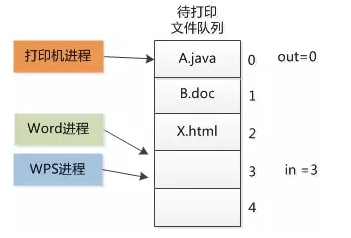
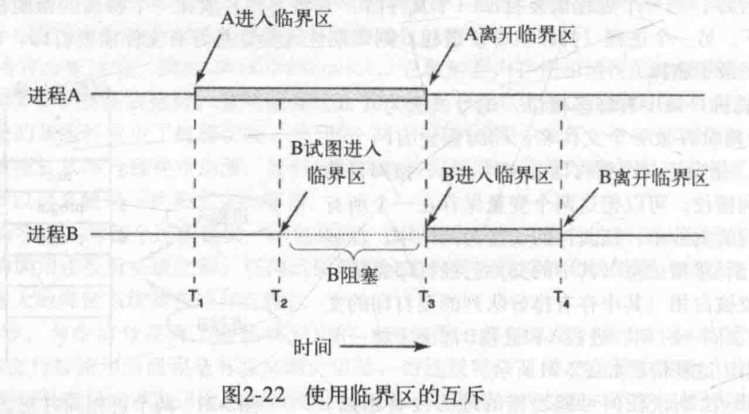
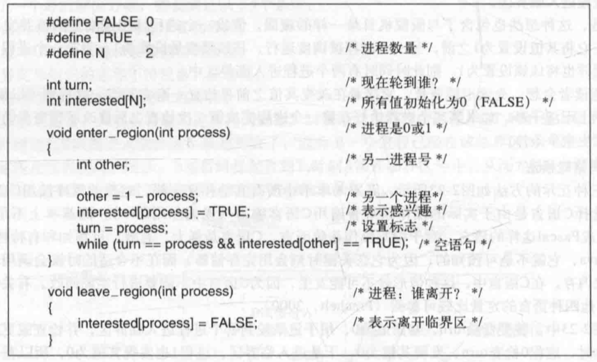

# 进程间通信(IPC Inter Process Communication)
解决进程间通信，需要解决三个问题。这些问题同样适用于线程。
1. 进程A如何把信息传递给进程B
2. 进程A、B在关键活动中不会出现交叉
3. 进程A、B的正确执行顺序

要解决问题一，需要两个进程之间有一个能够读写的共用存储区。但是有了这个公共区域又出现了一个新问题，就是进程之前存在**竞争关系**。        

用曾经真实存在的打印机的例子举例。

曾经计算机属于昂贵的东西，想要打印都要人们按照顺序将文件放入。根本无需考虑其他问题，计算机按顺序执行就可以了。这叫**脱机打印**。

可是后来计算机便宜了，每个人都有，然后计算机开辟一块专门的打印的区域给他们使用，只要每个人将文件存放在这里，打印机按照队列来打印就可以了。这叫**假脱机打印**。

然而这会造成一个问题。因为这个区域是公共的，A进程发现一个空区域`in = 3`，然后把要打印的Word存放进去，突然这个时候操作系统觉得他运行时间过长了，打了个`中断`。然后WPS也读取了`in = 3`这块区域，将自己的文件填充了进去，中断结束，Word回来继续之前的操作，把WPS给覆盖掉了。

为了避免竞争，多个进程同事读写共享数据的时候，需要**互斥**。        
这种对共享变量，共享内存，共享资源进行访问的程序片段叫做**临界区**。

我们的解决方案要满足四个条件：
1. 任何两个进程不能同时处于其临界区（互斥）
2. 不应对CPU的速度和数量做任何假设
3. 临界区外运行的进程不得阻塞其他进程（前进）
4. 不得使进程无限期等待进入临界区（有限等待） 

## 一、屏蔽中断
也许在单核处理器当中这种方式有不错的效果，但是把屏蔽中断的权利交给用户进程是不明智的，且随着CPU的发展，多核处理器使用这种方案明显不现实且太过复杂。

## 二、锁变量
在进程想要进入临界区的时候申请一把锁锁住。但是这也存在着两个进程同时申请锁，并同时锁上的情况。无济于事。

## 三、严格轮换发
进程轮流进入临界区，进入之后将共享变量改变值。而临界区外的进程则不断测试共享变量是否变回初始值，等待变量直到某个值出现为止。这叫**忙等待**。

这也像是一个锁，用于忙等待的锁叫**自旋锁**。

这违反了第三个条件，但是当有理由认为等待时间是非常短的情况下，这个方案是可以使用的。

## 四、Peterson解法

两个进程几乎同时调用`enter_region`。他们都将自己的进程号存入`turn`，但是只有后被保存进去的进程号才有效，前一个被重写丢失了。假设进程1是后存入的，则turn为1.当两个进程都运行到while语句时，进程0将循环0次并进入临界区，而进程则将不停地循环且不能进入临界区，直到进程0退出临界区为止。

从并发的角度考虑Peterson算法，当多个进程都需要进入临界区时，全局变量会被最后一个运行的进程所覆盖掉值，从而制定了某个进程进入临界区，而其他进程在临界区外等待。 同样其他进程执行完以后，将interested[process]置为false。那么当前进程也不会进入while循环，而是进入临界区，则不会造成阻塞的现象。

这个解法其实也存在着忙等待的问题。

## 消费者-生产者问题（有界缓冲区问题）
两个进程之间的问题解决了，还得考虑公共资源区域大小是否饱满的问题。打印机需要读取的队列空了则要等待，队列满了，进程则要等待有空位。

缓冲区有三种状态：空、非空、满。

空的情况下，消费者进入睡眠状态，等待唤醒。

满的情况下，生产者进入睡眠状态，等待唤醒。

解决这个问题我们需要引入一个新的变量——**信号量**。用于记录累计唤醒次数。

唤醒次数和睡眠次数是相对应的，信号量记录了唤醒操作，防止唤醒操作丢失。

