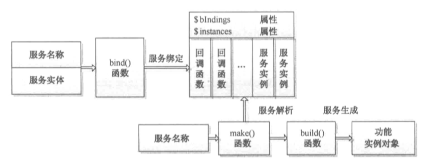

## Ioc容器
IOC容器是laravel的核心也是难点。以下是简单的核心实现方法，实际上laravel要比这个更加复杂。

```php
<?php
interface Visit
{
    public function go();
}

class Leg implements Visit
{
    public function go()
    {
        echo 'walt to tibet!!!';
    }
}

class Car implements Visit
{
    public function go()
    {
        echo 'drive car to tibet!!!';
    }
}

class Train implements Visit
{
    public function go()
    {
        echo 'by train to tibet!!!';
    }
}

class Container
{
    //用于装提供实力的回调函数
    public $bindings = [];

    //绑定接口和生成相应实例的回调函数
    //$c 代表容器Conrainer
    //类似$this->bindings['Visit']['concrete'] = [function ($c) {return new Train();}, 'share' => false]
    public function bind($abstract, $concrete = null, $shared = false)
    {
        if (!$concrete instanceof Closure) {
            //提供不是回调函数，调用方法让他变成回调函数 function($c) {return new train();}
            $concrete = $this->getClosure($abstract, $concrete);
        }
        $this->bindings[$abstract] = compact('concrete', 'shared');
    }

    //默认生成实例的回调函数
    public function getClosure($abstract, $concrete)
    {
        //生成实例的回调函数，$c一般为Ioc容器对象，即build函数中的$concrete($this)
        return function ($c) use ($abstract, $concrete) {
            $method = ($abstract == $concrete) ? 'build' : 'make';
            //调用build或make方法返回实例
            return $c->$method($concrete);
        };
    }

    //生成实例对象
    public function make($abstract)
    {
        //首先解决接口和要实例化类之间的依赖关系
        $concrete = $this->getConcrete($abstract);
        if ($this->isBuildable($concrete, $abstract)) {
            $object = $this->build($concrete);
        } else {
            $object = $this->make($concrete);
        }
        return $object;
    }

    public function isBuildable($concrete, $abstract)
    {
        return $concrete === $abstract || $concrete instanceof Closure;
    }

    //获取绑定的回调函数
    public function getConcrete($abstract)
    {
        if (!isset($this->bindings[$abstract])) {
            return $abstract;
        }
        return $this->bindings[$abstract]['concrete'];
    }

    //实例化对象
    public function build($concrete)
    {
        if ($concrete instanceof Closure) {
            return $concrete($this);
        }
        //php反射类，知道类内的方法和所需的依赖参数
        $reflector = new ReflectionClass($concrete);
        if (!$reflector->isInstantiable()) {
            echo $message = "Target [$concrete] is not instantiable.";
        }
        $constructor = $reflector->getConstructor();
        if (is_null($constructor)) {
            return new $concrete;
        }
        $dependencies = $constructor->getParameters();
        $instances = $this->getDependencies($dependencies);
        //通过放射类的方法返回实例 new train()
        return $reflector->newInstanceArgs($instances);
    }

    //解决通过反射机制实例化对象时的依赖
    public function getDependencies($parameters)
    {
        $dependencies = [];
        foreach ($parameters as $parameter) {
            $dependency = $parameter->getClass();
            if (is_null($dependency)) {
                $dependencies[] = null;
            } else {
                $dependencies[] = $this->resolveClass($parameter);
            }
        }
        return (array) $dependencies;
    }

    public function resolveClass(ReflectionParameter $parameter)
    {   //得到类名make实例化
        return $this->make($parameter->getClass()->name);
    }
}

class Traveller
{
    protected $trafficTool;

    public function __construct(Visit $trafficTool)
    {
        $this->trafficTool = $trafficTool;
    }

    public function visitTibet()
    {
        $this->trafficTool->go();
    }
}

$app = new Container();
$app->bind('Visit', 'Train');

$app->bind('traveller', 'Traveller');
var_dump($app->bindings['Visit']['concrete']);
$tra = $app->make('traveller');
$tra->visitTibet();

#dump
object(Closure)#2 (3) {
  ["static"]=>
  array(2) {
    ["abstract"]=>
    string(5) "Visit"
    ["concrete"]=>
    string(5) "Train"
  }
  ["this"]=>
  object(Container)#1 (1) {
    ["bindings"]=>
    array(2) {
      ["Visit"]=>
      array(2) {
        ["concrete"]=>
        *RECURSION*
        ["shared"]=>
        bool(false)
      }
      ["traveller"]=>
      array(2) {
        ["concrete"]=>
        object(Closure)#3 (3) {
          ["static"]=>
          array(2) {
            ["abstract"]=>
            string(9) "traveller"
            ["concrete"]=>
            string(9) "Traveller"
          }
          ["this"]=>
          *RECURSION*
          ["parameter"]=>
          array(1) {
            ["$c"]=>
            string(10) "<required>"
          }
        }
        ["shared"]=>
        bool(false)
      }
    }
  }
  ["parameter"]=>
  array(1) {
    ["$c"]=>
    string(10) "<required>"
  }
}
by train to tibet!!!

#可以看到起始就有一个闭包类，里面有抽象的Visit和具体的Train
```
- bind()：将类进行绑定
- singleton()：将类或接口绑定到只解析一次的容器中。一旦单例绑定被解析，相同的对象实例会在随后的调用中返回到容器中，bind的特例，shared参数为true，也是进行绑定。 
```php
$app->singleton(
    Illuminate\Contracts\Console\Kernel::class,
    App\Essential\Console\Kernel::class
);
```
- make()：实例化
- build()：构建关系返回实例


