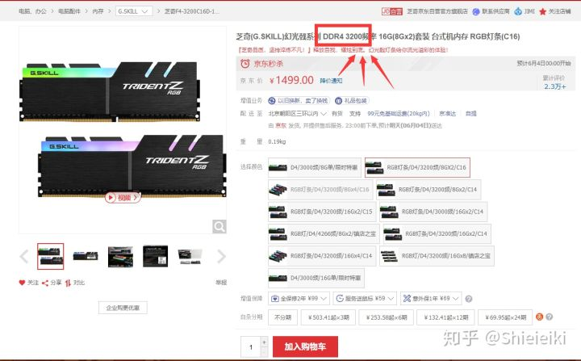
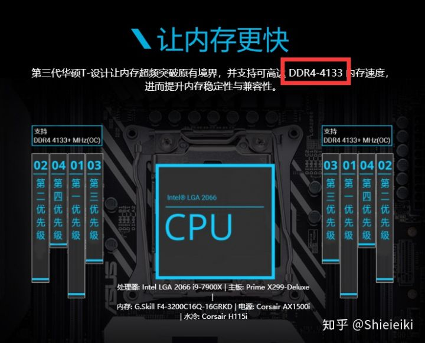

# 高频内存与主板内存频率和CPU内存频率之间的关系
## 频率
电子元件工作的时候会运行在一定的频率下，频率越高，这个元件的处理速度越快，这就和汽车发动机的马力一样，但是在电脑中，性能不单单只是由频率这一项参数决定，所以频率仅限相同的产品，同一代进行横向对比。

## 超频
电子元件既然会照着一定的频率运行，这个频率肯定不是凭空而来，他是厂家在出厂的时候人为设定的，厂家会将频率设定在一个能长期稳定运行的状态下，既然频率是人为设定的，那我们也可以去人为更改，将默认的频率手动修改到更高，让元件超负荷运转，这就是俗称的超频，由于频率高了，电压与发热也会变高，因此超频虽然能免费提升性能，但也要承担相应风险。

影响内存最终频率的因素
1. 内存条的标注频率
2. CPU的内存频率
3. 主板的默认内存频率
4. 主板的最高内存频率

## 一、内存条的标注频率
内存条的标注频率指的就是你在买内存的时候，商品标题所写的内存频率，这个就是代表了内存条的物理属性。

内存条的标注频率代表了这个内存最高可以稳定工作在什么样的频率下，这里有两个关键词就是最高和稳定，内存频率是人为设定的，只要你想，2400的内存同样可以设定为3200，能不能开机正常使用就是另一回事了，所以你去买内存的时候，所谓的3200频率的内存，并不代表你买回去插上直接用就是3200频率，也不代表这个内存只能工作在3200频率下，其真正的含义是这个内存可以100%毫无压力工作在3200及以下的频率范围内，如果工作在3200以上的频率也不是不可以，只是压力可能会大一点。

这里举个例子就知道了，你买了个车，商家告诉你最高能跑120迈，那么你平时跑60或者90迈都可以，但是你要是跑130迈，发动机就会过载，但是也不是不能跑，就是有风险而已。这里商家标注的内存频率就是指这个120迈。

## 二、限制内存频率的关键因素
1. 内存条本身的标注频率
2. CPU的默认内存频率
3. 主板的默认内存频率
4. 主板的超频内存频率

这里如果你是买回去插上就直接用，根本不打算去人为调整内存频率，不超频的情况，那么就是以前三条最低的为准。

6代CPU和100系主板对应，默认频率2133

7代CPU和200系主板对应，默认频率2400

8代CPU和300系主板对应，默认频率2666

假如你买了个2133的内存，CPU是i7 7700K（默认内存频率2400），主板是Z270（默认内存频率2400），这时候你什么都不调整，开机就是2133，因为主板和CPU虽然不会限制内存发挥，但是内存本身跑不了那么高，他就会维持自身的频率。

假如你买了个2400的内存，CPU是i7 7700K（默认内存频率2400），主板是Z170（默认内存频率2133），这时候内存本身不构成瓶颈，CPU也不是瓶颈，但是主板瓶颈了，那么默认频率就是2133。

假如你买了个3200的内存，CPU是i7 8700K（默认内存频率2666），主板是Z370（默认内存频率2666），这时候CPU和主板出现了默认频率瓶颈，即便内存能跑的很高，但是主板和CPU本身的频率规定会限制内存发挥，他只能工作在2666下。

## 三、主板内存超频频率
首先，只考虑Intel的情况，绝大多数的B系列和几乎全部的H系列主板都是无法对内存进行超频的，所以内存默认频率就是上面第二个大标题中介绍的，3条取最低，但是Z系列主板是可以对CPU和内存超频的，因此，如果你想要使用高频内存，请务必配备Z系列的主板。

当你选择了针对内存进行超频，那么内存的标注频率，主板的默认内存频率和CPU的默认内存频率都将被无视，这时候限制条件只有2个：内存条本身的最大频率和主板超频的最大频率。

如果你希望你的内存频率超出主板和CPU的默认限制，那就必须手动去调整，也就是超频，所以那些买了3200的内存，开机后显示2400不要怪商家给你发假货，因为你没去超频，3200说的是这个内存最高可以在3200频率下稳定工作，不是你插上去就是3200的，必须你自己去超频。

3200的内存，你选择超频后，再差都能工作在3200频率下，但是你也可以尝试冲击更高的频率，比如3600甚至4266，能不能用就是另外一回事了。2400的内存再差也能工作在2400频率下，你也可以尝试2666甚至3000频率，能不能用也是另外一回事了。

这时候主板能支持多少频率的内存就是关键因素了，假如主板就支持到4000频率的内存，你内存就算能到4266也没用，因为主板已经扛不住了，如果你的主板支持4266的内存，你内存条标注3200，超频到了3600就已经无法开机了，那么你也只能维持3200的频率。

1. 内存条的标注频率代表该内存最高可以稳定在这个频率下工作
2. 主板CPU和内存本身这三条是限制默认频率的关键
3. 超频的时候，限制条件只有内存本身和主板最高内存频率
4. 高频内存确实有性能提升，但是十分有限
5. 要根据总体配置决定你是否需要高频内存

本篇文章来自[知乎](https://zhuanlan.zhihu.com/p/37625674)       
作者：Shieieiki